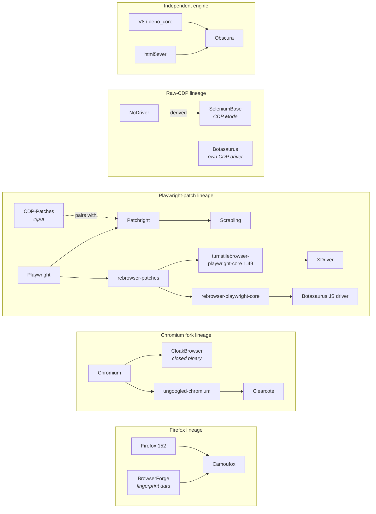

# Anti-Detect Browser Tools — Technical Comparison

Source-verified comparison of nine open-source browser-automation and anti-detection
tools. Each claim carries an evidence tier stating how it was established.

[](STATUS.md)
[](METHODOLOGY.md)
[](#tools-covered)
[](CODE-REVIEW.md)
[](docs/index.html)

- **Interactive view:** [`docs/index.html`](docs/index.html) — filterable matrix, findings, metrics, lineage
- **Verification date:** 2026-08-14
- **Version and project-health data:** [STATUS.md](STATUS.md), generated by `python scripts/verify.py --write`
- **Code quality, security patterns, maintainability:** [CODE-REVIEW.md](CODE-REVIEW.md)
- **Method, scope, and limits:** [METHODOLOGY.md](METHODOLOGY.md)
- **Revision history and corrections:** [CHANGELOG.md](CHANGELOG.md)

---

## Disclosure

> [!IMPORTANT]
> This repository is sponsored by [Scrappey](https://scrappey.com/), a commercial
> web-data API — a paid substitute for the tools compared here. The sponsor has a
> commercial interest in how these tools are described.

Constraints applied as a result:

- Scrappey is not rated, scored, or listed in any comparison table in this repository.
- Claims about Scrappey are subject to the same evidence tiers as any other vendor. No
  independently reproduced benchmark for it exists, so its coverage claims would be
  Tier B.
- Disagreements about a specific claim are handled as defects: [open an issue](../../issues)
  quoting the claim and citing a source.

Full policy: [METHODOLOGY.md § Conflict of interest](METHODOLOGY.md#conflict-of-interest).

---

## Evidence tiers

| Tier | Definition | Established by |
|:----:|-----------|----------------|
| **A** | Verified in source at a stated commit | Reading the code in an isolated container; file paths cited |
| **B** | Vendor-reported, not reproduced here | The project's README, release notes, or docs |
| **C** | Community-reported | Issue trackers, forums, third-party posts |
| **D** | Not established | No evidence located in either direction |

Two constraints follow from the method (see [METHODOLOGY.md](METHODOLOGY.md#what-we-did-not-do)):

1. **No claim about anti-bot service outcomes in this repository exceeds Tier B.** No
   head-to-head benchmark against Cloudflare, DataDome, Kasada, Akamai, PerimeterX, or
   Imperva was run.
2. **Vendor-published benchmarks remain Tier B** regardless of detail. They record what
   the vendor observed on the vendor's configuration.

> [!NOTE]
> **Tier D means nobody published a test — not that the tool failed one.** Collapsing
> "not established" into "does not implement" is the most common way a comparison
> misleads, so the two are never merged here.

---

## Tools covered

| Tool | Implementation | Language | License | Page |
|------|---------------|----------|---------|------|
| **Camoufox** | Firefox fork; fingerprint controls compiled into C++ | Python | MPL-2.0 (browser), MIT (wrapper) | [camoufox.md](./camoufox.md) |
| **Patchright** | Playwright driver source patched at build time via AST rewrite | Python, Node, .NET | Apache-2.0 | [patchright.md](./patchright.md) |
| **SeleniumBase** | Patched ChromeDriver (UC Mode) + CDP-native driver (CDP Mode) | Python | MIT | [seleniumbase.md](./seleniumbase.md) |
| **Botasaurus** | Raw-CDP driver + scraping framework | Python | MIT | [botasaurus.md](./botasaurus.md) |
| **XDriver** | File-replacement patcher shipping a prebuilt `playwright-core` fork | Python | Apache-2.0 | [xdriver.md](./xdriver.md) |
| **CloakBrowser** | Chromium fork with C++ patches; open wrapper, closed binary | Python, Node, .NET | MIT (wrapper), proprietary (binary) | [cloakbrowser.md](./cloakbrowser.md) |
| **Scrapling** | Scraping framework: HTTP and browser tiers, parser, spider | Python | BSD-3-Clause | [scrapling.md](./scrapling.md) |
| **Obscura** | Browser engine implemented from scratch in Rust | Rust; CDP clients | Apache-2.0 | [obscura.md](./obscura.md) |
| **Clearcote** | ungoogled-chromium fork; published patches, fingerprint import | Python, Node | BSD-3-Clause | [clearcote.md](./clearcote.md) |

Versions, release dates, star counts, contributor counts, and last-push dates:
[STATUS.md](STATUS.md).

### Changes since the 2026-07-06 revision

Seven of nine tools published releases. Two changes altered previously documented behaviour:

- **Obscura v0.2.0 (2026-08-08)** added a layout and paint engine
  (`crates/obscura-render`, 66,826 lines). The prior analysis stated Obscura had no
  layout engine; that is obsolete for render-enabled builds.
- **CloakBrowser's Pro binary** moved to Chromium 150 with 71 patches. Previously
  documented as Chromium 148 with 66 patches, and as 33 patches in one inconsistent
  sentence.

Corrections to claims that were unsupported rather than merely stale are itemised in
[CHANGELOG.md](CHANGELOG.md).

---

## Architecture

**Tier A** unless a cell states otherwise. Read from source at the commits listed in
[STATUS.md](STATUS.md). Cells state what the code does; they are not ratings.

### Stealth implementation

| | Camoufox | Patchright | SeleniumBase | Botasaurus | XDriver | CloakBrowser | Scrapling | Obscura | Clearcote |
|---|---|---|---|---|---|---|---|---|---|
| **Browser engine** | Firefox 152.0.4 fork | stock Chromium | stock Chromium | stock Chromium | stock Chromium | Chromium 150 fork (Pro) / 146 (free) | delegates | own Rust engine | Chromium 149 fork (ungoogled) |
| **Modification method** | C++ source patches: 34 in `patches/`, 2 in `patches/playwright/` | AST rewrite of the Playwright driver (`patchright_driver_patch.ts`, 265 lines, `ts-morph`) | ChromeDriver binary rewrite (`undetected/patcher.py`) + CDP driver (`undetected/cdp_driver/`) | raw CDP over WebSocket; 58 generated binding files in `botasaurus_driver/cdp/` | file replacement with a prebuilt bundle (`turnstilebrowser-playwright-core` 1.49.0) | C++ source patches: 71 (Pro), 58 (free), 26 (macOS free) — **Tier B**, counts from vendor README | dependency on Patchright + `curl_cffi` | JS shims + native ops in its own runtime | C++ source patches: 32, listed in `patches/series` |
| **`navigator.webdriver`** | C++ patch | driver patch | driver patch | CDP | prebuilt bundle | C++ patch (**Tier B**) | inherited from Patchright | runtime shim | C++ patch `010-user-agent-and-webdriver` |
| **`Runtime.enable` tell** | not applicable — automation runs over Juggler, not CDP; the only source references are a test and a build-checker | avoided by executing JS in isolated contexts, with the Console API disabled (mechanism documented in the project README) | **Tier D** — no handling located in source; CDP Mode attaches no WebDriver | **none** — the sole reference is a commented-out line, `connection.py:219` | rebrowser-lineage patch in the bundle, gated behind `TURNSTILEBROWSER_PATCHES_*` env vars | **Tier D** — not addressed in the wrapper README's patch list; binary is closed and cannot be inspected | inherited from Patchright | own CDP server implementation | C++ patch `110-runtime-enable` |
| **TLS/JA3 impersonation** | none — real Firefox TLS | none — real Chrome TLS | none | none | none | none — real Chrome TLS | **yes**, HTTP tier only: `curl_cffi>=0.16.0` | **optional**, build-gated: `wreq` behind `--features stealth` | none — real Chrome TLS |
| **Input simulation** | `humanize`, `humanize:minTime`, `humanize:maxTime` config properties (`settings/properties.json:69-71`) | none; the project pairs with the separate CDP-Patches library | OS-level clicks via PyAutoGUI (`browser_launcher.py:1071-1082`) and timing jitter; **no motion model** | Bézier trajectories with Gaussian distortion and easing (`human_curve_generator.py`) | none — the only matches are incidental strings in bundled Playwright assets | `humanize` option; extensive implementation (**Tier B** — closed binary) | none first-party; passes options through to Patchright | none — `bezier` matches are CSS `cubic-bezier` easing and canvas `bezierCurveTo` | C++ patches `130-humanized-input`, `200-agent-and-humanized-input` |
| **Engine source published** | yes — patches + build script; binary is rebuildable | n/a — patches stock Chromium | n/a — patches stock ChromeDriver | n/a — drives stock Chromium | no — prebuilt bundle; upstream rebrowser-patches is public, this bundle is not built from published sources | **no** — no patches directory or build script in the repository; binary is proprietary | n/a — delegates | yes — the repository is the engine | yes — patches + build docs; signed, checksummed releases |

### Non-stealth capabilities

| | Camoufox | Patchright | SeleniumBase | Botasaurus | XDriver | CloakBrowser | Scrapling | Obscura | Clearcote |
|---|---|---|---|---|---|---|---|---|---|
| **Layout and rendering** | Gecko | Blink | Blink | Blink | Blink | Blink | Blink (browser tier) | own engine, 66,826 lines — **render-enabled builds only** | Blink |
| **HTML parser included** | no | no | no | no | no | no | yes | yes (`html5ever`) | no |
| **Crawler framework** | no | no | no | yes | no | no | yes | no | no |
| **CAPTCHA handling** | no | no | click-based solving for several vendors | Cloudflare challenge automation | no | no | `solve_cloudflare` for Turnstile/Interstitial | no | no |
| **Test framework integration** | no | no | pytest, unittest | no | no | no | no | no | no |

### Notes on reading these tables

- **Patch counts measure surface area touched, not quality.** Projects split changes at
  different granularities; 71 patches and 32 patches are not comparable quantities.
- **"Delegates" describes a dependency relationship, not a deficiency.** Scrapling's
  browser-tier evasion is Patchright's implementation, so Scrapling inherits Patchright's
  properties and limits in that tier.
- **Absence of TLS impersonation is expected for real-browser tools.** A real browser
  produces a real browser's TLS signature. The row is decision-relevant only for
  HTTP-only request paths.
- **Two cells changed direction during verification** on 2026-08-14: SeleniumBase and
  CloakBrowser `Runtime.enable` were previously stated as handled, in both the July 2026
  revision and an earlier draft of this one. Neither is supported by locatable evidence.

---

## Anti-bot service claims

> [!WARNING]
> No benchmark was run for this table. It records **who claims what**, not what works.
> Vendor checkmarks are not comparable across projects — each used undisclosed targets,
> dates, IP types, and pass criteria.

What follows is the provenance of each project's own claims.

| Tool | Services the project claims | Tier | Basis stated by the project |
|------|---------------------------|:----:|------------------------------|
| **Patchright** | Cloudflare, Kasada, Akamai, DataDome, Shape/F5, Bet365, Fingerprint.com, CreepJS, and others | B | README list; no methodology, targets, dates, or trial counts published |
| **XDriver** | Cloudflare WAF, Turnstile, DataDome, Kasada, PerimeterX, Imperva, Fingerprint.com | B | README table dated September 2025. The bundle is pinned to `playwright-core` 1.49.0 and the repository has no commits since 2025-09-10 |
| **Botasaurus** | Cloudflare WAF, Cloudflare Turnstile, DataDome | B | Test functions exist in `bot_detection_tests.py` (Tier A) targeting vendor demo endpoints; pass results are the vendor's claim |
| **CloakBrowser** | Turnstile, FingerprintJS, reCAPTCHA v3 score 0.9, "30+ detection sites" | B | README results table; the strongest figures are gated to the paid Pro binary. Free binary is not claimed to reach them |
| **SeleniumBase** | Cloudflare, Imperva/Incapsula, DataDome, Kasada, PerimeterX, reCAPTCHA | B | Runnable example scripts committed to `examples/cdp_mode/` (their existence is Tier A); outcomes are not published as measurements |
| **Scrapling** | Cloudflare Turnstile | B | `solve_cloudflare` exists in source (Tier A). The README routes Akamai, DataDome, Kasada, and Incapsula to a third-party paid API rather than claiming them |
| **Camoufox** | none | D | Makes no service claims. Its README documents a limitation: some WAFs probe SpiderMonkey engine behaviour, which a Firefox fork does not conceal (Tier B) |
| **Obscura** | none | D | No service claims in the README |
| **Clearcote** | none | D | Publishes open-auditor results (CreepJS) and a self-referential coherence gate; no WAF pass rates |

### Constraints on interpreting this table

- It records claims, not capability. A claim's presence is evidence about the project's
  marketing; its absence is evidence about the project's marketing.
- Vendor checkmarks are not comparable across projects. Each used undisclosed targets,
  dates, IP types, and pass criteria.
- The previous revision of this document contained a 7-service × 9-tool grid of
  ✅/⚠️/❌ — 63 verdicts. None were benchmarked. That grid was removed rather than
  updated.
- Claim breadth in this table does not correlate with maintenance status. XDriver states
  the widest coverage and has the lowest commit activity and contributor count of the
  nine (see [STATUS.md](STATUS.md)).

---

## Lineage — nine tools, fewer independent implementations

Several of these depend on each other. Selecting two for redundancy can mean selecting
the same implementation twice: if that lineage is fingerprinted, both fail together.
Every edge below was verified in source (**Tier A**).



What this shows:

- **Scrapling's browser tier *is* Patchright** (`patchright>=1.61.2`). Choosing both is
  choosing one implementation.
- **SeleniumBase's CDP Mode is NoDriver-derived** — stated in the file headers of
  `undetected/cdp_driver/cdp_util.py` and `browser.py`.
- **XDriver and Botasaurus's JS driver both descend from rebrowser-patches**
  (`turnstilebrowser-playwright-core` 1.49.0; `rebrowser-playwright-core` ^1.49.1).
- **Camoufox, Obscura, Clearcote and CloakBrowser are genuinely independent** of the
  Playwright-patch family, though three of the four are Chromium-derived.

---

## Code quality

Detection capability and code quality are independent properties. Full analysis —
size, typing, tests, error handling, dependency hygiene, security patterns, with
per-file citations — is in **[CODE-REVIEW.md](CODE-REVIEW.md)**. Metrics are reproducible
via `scripts/codemetrics.py`.

Findings that bear on a build decision:

| Finding | Detail |
|---------|--------|
| **CloakBrowser runs with the Chromium sandbox disabled** | `--no-sandbox` is hardcoded in `config.py:54-66` and applied to every launch. The argument merge can override flags but cannot remove them; the only opt-out (`stealth_args=False`) also removes the fingerprint seed. Combined with a closed binary, this means unauditable native code processing hostile input with no OS sandbox. Not mentioned in the project README. |
| **XDriver ships a frozen bundle with no drift detection** | A prebuilt `playwright-core` 1.49.0 fork, 295 lines of first-party Python, zero tests. Nothing detects that upstream has moved. |
| **Patchright handles a fragile approach well** | AST patching that fails loudly (`*OrThrow` accessors throughout) plus `check_patch_impact.yml`, which diffs Playwright versions and can open an issue on breaking changes. |
| **SeleniumBase is large and largely untyped** | 99,701 production lines; `base_case.py` is 17,670 lines and 579 methods in one class; 2.7% of functions carry any annotation; 506 broad `except` handlers; 548 sleep calls. Effective, but expensive to fork or debug. |
| **Obscura relies on `.unwrap()`** | 2,326 in production Rust, concentrated in CDP handlers, with `catch_unwind` in only four files. Relevant if you run `obscura serve` as a long-lived service. |
| **Botasaurus swallows errors** | 38 bare `except:` clauses; `botasaurus-driver` has zero test files across 50,169 lines; PyPI (4.0.101) is ahead of the published source (4.0.92). |
| **Scrapling has the cleanest Python** | 83.5% annotation coverage, 59.1% docstrings, 0 bare excepts, 59 test files, the only pre-commit config in the set. |

## Project health

**Counts are not duplicated here.** Stars, forks, contributors, open issues, last-push
dates, and published versions live in **[STATUS.md](STATUS.md)**, which is generated by
`scripts/verify.py`. Open-issue counts in particular change within hours, so a
hand-copied figure is wrong shortly after it is written; STATUS.md carries its own
generation date.

Stable, decision-relevant properties as of 2026-08-14:

| Property | Finding |
|----------|---------|
| **Proprietary components** | CloakBrowser only. Its MIT license covers the Python/Node/.NET wrapper; the Chromium binary is proprietary, and free and Pro builds differ in Chromium version and patch count. Every other tool is permissively licensed end to end. |
| **Split licensing** | Camoufox: MPL-2.0 for the Firefox fork, MIT for the Python wrapper. Relevant if you redistribute the browser. |
| **Maintenance concentration** | Clearcote has 1 contributor; XDriver has 2. The other seven have 9 to 47. |
| **Inactive project** | XDriver, last push 2025-09-10 — approximately 11 months before the verification date. The other eight were pushed within the three weeks preceding it. |
| **Registry ahead of source** | `botasaurus-driver` publishes 4.0.101 to PyPI while the repository's `setup.py` reads 4.0.92. The installed artifact does not correspond to a tagged commit. |
| **Prerelease status** | Clearcote's browser is `v0.1.0-pre.22`; Camoufox's current line is `v152.0.4-beta.28`. Both projects label their builds as non-final. |

Star counts appear in STATUS.md for completeness. They measure repository popularity and
have no established relationship to detection outcomes.

---

## Capability-to-implementation index

Maps a technical requirement to the tools whose source implements it, per the
[architecture tables](#architecture). This is a lookup, not a ranking; where more than
one tool qualifies, they are listed in table order.

| Requirement | Tools implementing it | Mechanism |
|-------------|----------------------|-----------|
| Fingerprint spoofing not observable as JS property-descriptor modification | Camoufox, CloakBrowser, Clearcote | Values substituted in C++ before JS can inspect them |
| Statistically distributed fingerprint rotation | Camoufox | BrowserForge-generated profiles |
| Import and present a specific captured device fingerprint | Clearcote | `--fingerprint-profile` with a bundled verifier |
| Unmodified Playwright API surface | Patchright, CloakBrowser, Clearcote | Drop-in driver or SDK |
| `Runtime.enable` tell addressed | Patchright, Clearcote, Camoufox (not applicable — Juggler) | Isolated contexts; C++ patch; non-CDP protocol |
| TLS/JA3 impersonation on HTTP requests | Scrapling, Obscura (build-gated) | `curl_cffi`; `wreq` |
| Mouse-motion model for input | Botasaurus, CloakBrowser, Clearcote, Camoufox | Bézier trajectories; C++ humanized input; `humanize` config |
| CAPTCHA handling in-framework | SeleniumBase, Scrapling (Cloudflare only), Botasaurus (Cloudflare only) | Click-based solving; `solve_cloudflare` |
| HTML parsing without a separate library | Scrapling, Obscura | lxml-based parser; `html5ever` |
| Crawler/spider framework | Scrapling, Botasaurus | Scrapy-like spiders; framework primitives |
| Node.js or .NET client | Patchright, CloakBrowser, Clearcote | Published SDKs |
| Test-framework integration | SeleniumBase | pytest, unittest |
| Rebuildable engine from published sources | Camoufox, Clearcote, Obscura | Patches + build scripts; Rust workspace |
| Signed, checksummed release binaries | Clearcote | GPG signature + SHA-256 |
| Resident memory below a browser's | Scrapling (HTTP tier), Obscura | No browser process; own engine — **Tier B**, vendor figures |
| Firefox rather than Chromium engine | Camoufox | Firefox 152 fork |

Requirements with no tool in this set: macOS Clearcote builds, WebGL fingerprint
spoofing in Obscura, first-party handling of Akamai/DataDome/Kasada/Imperva in any of
the nine.

---

## Detection layers and which tools address them

Layer taxonomy with the tools whose source addresses each, per the architecture tables.

```
Layer 1 — Automation protocol tells
  Runtime.enable / execution contexts .... Patchright, Clearcote
  Non-CDP automation protocol ............ Camoufox (Juggler)
  ChromeDriver binary markers ............ SeleniumBase (cdc_ removal)
  CDP input characteristics .............. CloakBrowser (Tier B), Clearcote

Layer 2 — Browser fingerprinting
  navigator.webdriver .................... all nine
  Canvas / WebGL ......................... Camoufox, CloakBrowser (Tier B), Clearcote
  Screen / window geometry ............... Camoufox, CloakBrowser (Tier B), Clearcote
  AudioContext ........................... Camoufox, CloakBrowser (Tier B), Clearcote
  Font enumeration ....................... Camoufox, CloakBrowser (Tier B), Clearcote

Layer 3 — Behavioural signals
  Mouse-motion model ..................... Botasaurus, CloakBrowser, Clearcote, Camoufox
  Click and keystroke timing ............. Botasaurus, SeleniumBase, CloakBrowser
  Navigation patterns .................... not addressed by any tool; a property of
                                           calling code, not the driver

Layer 4 — Network
  TLS fingerprint (JA3/JA4) .............. Scrapling (HTTP tier), Obscura (build-gated)
  WebRTC / UDP leakage ................... Camoufox, Clearcote
  IP reputation .......................... not addressed by any tool
  DNS leakage ............................ not addressed by any tool

Layer 5 — Layout and rendering probes
  getBoundingClientRect .................. all real-browser tools; Obscura in
                                           render-enabled builds only
  getComputedStyle ....................... all real-browser tools; Obscura in
                                           render-enabled builds only
  Canvas/WebGL pixel output .............. all real-browser tools; Clearcote can forward
                                           canvas operations to real GPU hardware
```

Layers 3 (navigation patterns), 4 (IP reputation, DNS), and any account-history signal
are outside what a browser-automation library controls. They are properties of
infrastructure and calling code.

---

## Variables affecting outcomes

The previous revision published a table of success-rate percentages by protection tier
(«90%+», «60-80%», «20-40%», «<20%»). No study, target list, sample size, or date was
attached to those figures, and they have been removed rather than revised.

What can be stated without a benchmark is which variables the tool layer does and does
not control:

| Variable | Controlled by the tools compared here? |
|----------|----------------------------------------|
| Browser fingerprint surface | Yes — the primary function of Camoufox, CloakBrowser, Clearcote |
| Automation protocol tells | Yes — Patchright, Clearcote, SeleniumBase, Camoufox |
| Input event characteristics | Partially — four tools implement a motion model |
| TLS fingerprint | Only on HTTP-only paths (Scrapling, Obscura) |
| IP address reputation | **No** — supplied by your proxy provider |
| Request volume, timing, and path order | **No** — a property of your calling code |
| Account age and session history | **No** — outside the browser layer |
| Target's protection tier and configuration | **No** — and vendor claims rarely state which tier was tested |
| Durability over time | **No** — detection is adversarial; a passing result is scoped to that target on that date |

Consequence for evaluating any claim, in this repository or elsewhere: a stated pass
rate without the IP type, target list, protection tier, trial count, and date is
underspecified, because the unstated variables include ones the tool does not control.

---

## Detection test sites

Consistency auditors and vendor demos. Passing them is not evidence about production
WAF deployments.

| Test | Checks | URL |
|------|--------|-----|
| Sannysoft | Automation tells | [bot.sannysoft.com](https://bot.sannysoft.com/) |
| BrowserScan | Fingerprint surface | [browserscan.net](https://www.browserscan.net/bot-detection) |
| CreepJS | Fingerprint coherence and contradiction detection | [abrahamjuliot.github.io/creepjs](https://abrahamjuliot.github.io/creepjs/) |
| Fingerprint.com | Vendor bot-detection demo | [fingerprint.com](https://fingerprint.com/products/bot-detection/) |
| Pixelscan | Leak and consistency detection | [pixelscan.net](https://pixelscan.net/) |

---

## Reproducing this report

Version and health data:

```bash
python scripts/verify.py --write
```

Source verification. The nine projects are unaudited third-party code, including patched
browser binaries; they are cloned into a container and never onto a workstation:

```bash
./scripts/sandbox.sh up        # clone into a Docker volume, then disconnect the network
./scripts/sandbox.sh sh        # offline shell for reading source
./scripts/sandbox.sh nuke      # destroy container and volume
```

The container runs with `--cap-drop=ALL`, `--security-opt=no-new-privileges`, a
read-only root filesystem, and no network after cloning completes. No dependency
installation, build, test run, or binary execution is performed at any point in
producing this report; Tier A means the code was read, not run. Details:
[METHODOLOGY.md § Source handling](METHODOLOGY.md#source-handling).

---

## Contributing

To change a claim, [open an issue](../../issues) quoting it and supplying one of:

- a file path and commit that contradicts it (Tier A);
- vendor documentation that supersedes it (Tier B);
- a reproducible test stating target, IP type, protection tier, trial count, and dates
  (the only input that can raise an anti-bot service claim above Tier B).

To propose a tool: repository URL, modification method, and the claims it publishes.

---

## Scope and legal

This document describes publicly available software for security research, academic
work, authorised testing, and retrieval of one's own data. Respect `robots.txt`, rate
limits, and applicable terms of service. Laws governing automated access vary by
jurisdiction; this is not legal advice.

<!--
Repository topics: web-scraping, anti-detection, bot-detection, browser-automation,
fingerprint-spoofing, stealth-browser, playwright, selenium, puppeteer, cdp,
browser-fingerprinting, camoufox, patchright, seleniumbase, botasaurus, cloakbrowser,
scrapling, obscura, clearcote, firefox-automation, chromium, rust, web-automation
-->
