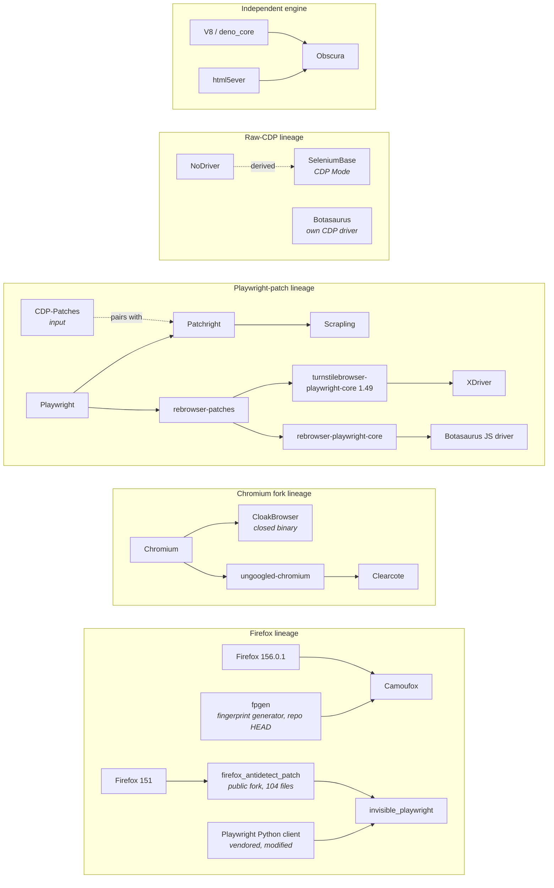

# Anti-Detect Browser Tools — Technical Comparison

Source-verified comparison of ten open-source browser-automation and anti-detection
tools. Each claim carries an evidence tier stating how it was established.

[](STATUS.md)
[](METHODOLOGY.md)
[](#tools-covered)
[](CODE-REVIEW.md)
[](docs/index.html)

- **Interactive view:** [`docs/index.html`](docs/index.html) — filterable matrix, findings, metrics, lineage
- **Verification date:** 2026-09-30
- **Version and project-health data:** [STATUS.md](STATUS.md), generated by `python scripts/verify.py --write`
- **Code quality, security patterns, maintainability:** [CODE-REVIEW.md](CODE-REVIEW.md)
- **Method, scope, and limits:** [METHODOLOGY.md](METHODOLOGY.md)
- **Revision history and corrections:** [CHANGELOG.md](CHANGELOG.md)

---

## Disclosure

> [!IMPORTANT]
> This repository is sponsored by [Scrappey](https://scrappey.com/), a commercial
> web-data API — a paid substitute for the tools compared here. The sponsor has a
> commercial interest in how these tools are described.

Constraints applied as a result:

- Scrappey is not rated, scored, or listed in any comparison table in this repository.
- Claims about Scrappey are subject to the same evidence tiers as any other vendor. No
  independently reproduced benchmark for it exists, so its coverage claims would be
  Tier B.
- Disagreements about a specific claim are handled as defects: [open an issue](../../issues)
  quoting the claim and citing a source.

Full policy: [METHODOLOGY.md § Conflict of interest](METHODOLOGY.md#conflict-of-interest).

---

## Evidence tiers

| Tier | Definition | Established by |
|:----:|-----------|----------------|
| **A** | Verified in source at a stated commit | Reading the code in an isolated container; file paths cited |
| **B** | Vendor-reported, not reproduced here | The project's README, release notes, or docs |
| **C** | Community-reported | Issue trackers, forums, third-party posts |
| **D** | Not established | No evidence located in either direction |

Two constraints follow from the method (see [METHODOLOGY.md](METHODOLOGY.md#what-we-did-not-do)):

1. **No claim about anti-bot service outcomes in this repository exceeds Tier B.** No
   head-to-head benchmark against Cloudflare, DataDome, Kasada, Akamai, PerimeterX, or
   Imperva was run.
2. **Vendor-published benchmarks remain Tier B** regardless of detail. They record what
   the vendor observed on the vendor's configuration.

> [!NOTE]
> **Tier D means nobody published a test — not that the tool failed one.** Collapsing
> "not established" into "does not implement" is the most common way a comparison
> misleads, so the two are never merged here.

---

## Tools covered

| Tool | Implementation | Language | License | Page |
|------|---------------|----------|---------|------|
| **Camoufox** | Firefox fork; fingerprint controls compiled into C++ | Python; TypeScript launcher in the repository | MPL-2.0 (browser), MIT (wrapper) | [camoufox.md](./camoufox.md) |
| **Patchright** | Playwright driver source patched at build time via AST rewrite | Python, Node, .NET | Apache-2.0 | [patchright.md](./patchright.md) |
| **SeleniumBase** | Patched ChromeDriver (UC Mode) + CDP-native driver (CDP Mode) | Python | MIT | [seleniumbase.md](./seleniumbase.md) |
| **Botasaurus** | Raw-CDP driver + scraping framework | Python | MIT | [botasaurus.md](./botasaurus.md) |
| **XDriver** | File-replacement patcher shipping a prebuilt `playwright-core` fork | Python | Apache-2.0 | [xdriver.md](./xdriver.md) |
| **CloakBrowser** | Chromium fork with C++ patches; open wrapper, closed binary | Python, Node, .NET | MIT (wrapper), proprietary (binary) | [cloakbrowser.md](./cloakbrowser.md) |
| **Scrapling** | Scraping framework: HTTP and browser tiers, parser, spider | Python | BSD-3-Clause | [scrapling.md](./scrapling.md) |
| **Obscura** | Browser engine implemented from scratch in Rust | Rust; CDP clients | Apache-2.0 | [obscura.md](./obscura.md) |
| **Clearcote** | ungoogled-chromium fork; published patches (open build), fingerprint import | Python, Node, .NET | BSD-3-Clause | [clearcote.md](./clearcote.md) |
| **invisible_playwright** | Firefox fork patched in C++, driven through a vendored, modified copy of Playwright's Python client and an in-process Python Juggler server | Python | MIT AND Apache-2.0 (wrapper, as declared in `pyproject.toml`; the vendored client is Apache-2.0), MPL-2.0 (engine fork) | [invisible-playwright.md](./invisible-playwright.md) |

Versions, release dates, star counts, contributor counts, and last-push dates:
[STATUS.md](STATUS.md).

### Changes since the 2026-08-14 revision

Eight of ten tools published releases. Material changes to previously documented behaviour:

- **Camoufox** moved to a Firefox 156.0.1 base (pre-release line `v156.0.1-beta.33`; 44
  patches, was 34). At repository HEAD, fpgen replaces BrowserForge as the fingerprint
  generator (PyPI 0.5.6 still uses BrowserForge), the cursor path is a replay of
  recorded movements generated in Juggler JS rather than a C++ generator, and canvas
  output is not perturbed.
- **invisible_playwright** (0.7.0 to 0.25.7): the wrapper now vendors a modified copy of
  Playwright's Python client and an in-process Python Juggler server, so "unmodified
  Playwright client" no longer holds. The `invisible_firefox` repository was deleted on
  2026-08-18. The launch ping is still on by default; it is now disclosed in the
  wrapper's CHANGELOG and shown as a badge, but not in the wrapper README text or docs.
- **Clearcote**'s open build moved to Chromium 150 with 37 patches (was 149 and 32); the
  SDKs went from 0.26.1 to 0.33.0 and the SDK list now includes .NET; the project README
  describes a free-with-GitHub tier and hosted browsers (**Tier B**).
- **CloakBrowser**'s Pro binary moved to Chromium 152 with 87 claimed patches (was 150
  and 71); a free GitHub-sign-in key tier receives the latest build. The sandbox finding
  is unchanged.
- **Obscura** v0.2.0 to v0.2.3: CDP and MCP endpoints refuse a non-loopback bind without
  a token (v0.2.3); a tenth workspace crate (`obscura-ssrf`); the render engine is
  69,866 lines.
- **Patchright** 1.61.x to 1.63.0: in the current source, init scripts are registered only
  through CDP `Page.addScriptToEvaluateOnNewDocument`; the project README still
  describes route-based injection (source read, not run). Scrapling's browser tier
  inherits this.
- **Scrapling** 0.4.15 (MCP tools 10 to 13; the HTTP transport requires a token) and
  **SeleniumBase** 4.54.13 (in-tree MCP server; the UC Mode code is unchanged).
- **Code metrics** were regenerated with a corrected `scripts/codemetrics.py` (five
  measurement defects fixed), so several earlier figures are not comparable; see
  [CODE-REVIEW.md](CODE-REVIEW.md#how-the-numbers-were-produced).

Corrections to claims that were already wrong at the 2026-08-14 commits, and to claims
that were unsupported rather than merely stale, are itemised in
[CHANGELOG.md](CHANGELOG.md).

---

## Architecture

**Tier A** unless a cell states otherwise. Read from source at the commits listed in
[STATUS.md](STATUS.md). Cells state what the code does; they are not ratings.

### Stealth implementation

| | Camoufox | Patchright | SeleniumBase | Botasaurus | XDriver | CloakBrowser | Scrapling | Obscura | Clearcote | invisible_playwright |
|---|---|---|---|---|---|---|---|---|---|---|
| **Browser engine** | Firefox 156.0.1 fork | stock Chromium | stock Chromium | stock Chromium | stock Chromium | Chromium 152 fork (Pro; 151 on macOS) / 146 (keyless free) — **Tier B** | delegates | own Rust engine | Chromium 150 fork (ungoogled; open build) | Firefox 151 fork |
| **Modification method** | C++ source patches: 44 in `patches/` (32 diff C/C++ sources), 2 in `patches/playwright/` | AST rewrite of the Playwright driver (`patchright_driver_patch.ts`, 275 lines, `ts-morph`) | ChromeDriver binary rewrite (`undetected/patcher.py`) + CDP driver (`undetected/cdp_driver/`) | raw CDP over WebSocket; 58 generated binding files in `botasaurus_driver/cdp/` | file replacement with a prebuilt bundle (`turnstilebrowser-playwright-core` 1.49.0) | C++ source patches: 87 (Pro), 58 (keyless free), 26 (macOS keyless free) — **Tier B**, counts from vendor README | dependency on Patchright + `curl_cffi` | JS shims + native ops in its own runtime | C++ source patches: 37, listed in `patches/series` | C++ source patches: 104 files on a public Firefox fork; no patch series |
| **`navigator.webdriver`** | C++ patch | driver patch | driver patch | CDP | prebuilt bundle | C++ patch (**Tier B**) | inherited from Patchright | runtime shim | C++ patch `010-user-agent-and-webdriver` | C++ patch |
| **`Runtime.enable` tell** | not applicable — automation runs over Juggler, not CDP; the only reference is a comment in a build-checker (`build-tester/src/lib/checks/core.ts:56`) | `Runtime.enable` sends are removed in the driver patch (`crPagePatch.ts`, `crDevToolsPatch.ts`, `crServiceWorkerPatch.ts`); isolated contexts and a disabled Console API are described in the project README (**Tier B**) | **Tier D** — no handling located in source; CDP Mode attaches no WebDriver | **none** — the sole reference is a commented-out line, `connection.py:219` | rebrowser-lineage patch in the bundle, gated behind `TURNSTILEBROWSER_PATCHES_*` env vars | **Tier D** — not addressed in the wrapper README's patch list; binary is closed and cannot be inspected | inherited from Patchright | own CDP server implementation | C++ patch `110-runtime-enable` | not applicable — Juggler, not CDP |
| **TLS/JA3 impersonation** | none — real Firefox TLS | none — real Chrome TLS | none | none | none | none — real Chrome TLS | **yes**, HTTP tier only: `curl_cffi>=0.16.1` | **optional**, build-gated: `wreq` behind `--features stealth` (only the `-stealth` release archives) | stock Chrome TLS by default; patch `210-tls-network-persona` swaps the post-quantum key-share group and the ALPS codepoint only when the claimed Chrome major differs from the build's | none — real Firefox TLS |
| **Input simulation** | `humanize`, `humanize:minTime`, `humanize:maxTime` config properties (`settings/properties.json:42-44`); the path replays recorded human movements (Cursory, 2,357 recordings, vendored `cursory-js`, LGPLv3-or-later) generated in Juggler JS (`additions/juggler/input/CursorTrajectory.js`), not in C++ | none; the project pairs with the separate CDP-Patches library, whose own README (v1.1, 2025-09-28) says the Chromium input leak is fixed upstream and the package is still needed only for Select elements (**Tier B**) | UC Mode: PyAutoGUI `moveTo(..., 0.25, easeOutQuad)` plus click (`browser_launcher.py:1244-1271`); CDP Mode `click()`: `Input.dispatchMouseEvent` move, then press and release at the element centre ±0.875 px with randomised pauses (`cdp_driver/element.py:498-583`); **no motion model** | Bézier trajectories with Gaussian distortion and easing (`human_curve_generator.py`) | none — the only matches are incidental strings in bundled Playwright assets | `humanize` option: Bézier mouse paths, typing with typos, scroll physics, DOM reads in an isolated world (wrapper source, **Tier A**); the binary-side CDP input mimicking is **Tier B** (closed binary) | none first-party; passes options through to Patchright (only the Cloudflare solver randomises its click offset and press delay, `_stealth.py:170-173`) | none — `bezier` matches are CSS `cubic-bezier` easing and canvas `bezierCurveTo` | C++ patches `130-humanized-input`, `200-agent-and-humanized-input`; the SDK also builds eased Bézier paths and sends them through Playwright's native mouse; recorded human trajectories are licensed-build only (project README, **Tier B**) | client-side: a seeded path planned in Python (`_motion.py`, `_cursor.py`), on by default (`humanize=True`, `launcher.py:103`) (**Tier A**) |
| **Engine source published** | yes — patches + build script; binary is rebuildable | n/a — patches stock Chromium | n/a — patches stock ChromeDriver | n/a — drives stock Chromium | no — prebuilt bundle; upstream rebrowser-patches is public, this bundle is not built from published sources | **no** — no patches directory or build script in the repository; binary is proprietary | n/a — delegates | yes — the repository is the engine | yes (open build) — patches + build docs; GPG-signed, SHA-256-checksummed releases. Licensed builds carry private patches and are not reproducible from public source (project README, **Tier B**) | **yes** — full public Firefox fork, but no patch series |

### Non-stealth capabilities

| | Camoufox | Patchright | SeleniumBase | Botasaurus | XDriver | CloakBrowser | Scrapling | Obscura | Clearcote | invisible_playwright |
|---|---|---|---|---|---|---|---|---|---|---|
| **Layout and rendering** | Gecko | Blink | Blink | Blink | Blink | Blink | Blink (browser tier) | own engine, 69,866 lines — **render-enabled builds only** | Blink | Gecko |
| **HTML parser included** | no | no | no | no | no | no | yes | yes (`html5ever`) | no | no |
| **Crawler framework** | no | no | no | yes | no | no | yes | no | no | no |
| **CAPTCHA handling** | no | no | click-based solving for several vendors | Cloudflare challenge automation | no | no | `solve_cloudflare` for Turnstile/Interstitial | no | no | no |
| **Test framework integration** | no | no | pytest, unittest | no | no | no | no | no | no | no |

### Notes on reading these tables

- **Patch counts measure surface area touched, not quality.** Projects split changes at
  different granularities; 87 patches and 37 patches are not comparable quantities.
- **"Delegates" describes a dependency relationship, not a deficiency.** Scrapling's
  browser-tier evasion is Patchright's implementation, so Scrapling inherits Patchright's
  properties and limits in that tier.
- **Absence of TLS impersonation is expected for real-browser tools.** A real browser
  produces a real browser's TLS signature. The row is decision-relevant only for
  HTTP-only request paths.
- **Two cells changed direction during verification** on 2026-08-14: SeleniumBase and
  CloakBrowser `Runtime.enable` were previously stated as handled, in both the July 2026
  revision and an earlier draft of this one. Neither is supported by locatable evidence.
- **Several cells were corrected on 2026-09-30 for claims that were already inaccurate at
  the 2026-08-14 commits**: Obscura WebGL and canvas, Camoufox canvas noise and its
  `Runtime.enable` test reference, invisible_playwright's "unmodified Playwright client",
  and Clearcote's network-stack statement (patch `210-tls-network-persona`). They are
  itemised in [CHANGELOG.md](CHANGELOG.md).

---

## Anti-bot service claims

> [!WARNING]
> No benchmark was run for this table. It records **who claims what**, not what works.
> Vendor checkmarks are not comparable across projects — each used undisclosed targets,
> dates, IP types, and pass criteria.

What follows is the provenance of each project's own claims.

| Tool | Services the project claims | Tier | Basis stated by the project |
|------|---------------------------|:----:|------------------------------|
| **Patchright** | Cloudflare, Kasada, Akamai, DataDome, Shape/F5, Bet365, Fingerprint.com, CreepJS, and others | B | README list; no methodology, targets, dates, or trial counts published |
| **XDriver** | Cloudflare WAF, Turnstile, DataDome, Kasada, PerimeterX, Imperva, Fingerprint.com | B | README table dated September 2025. The bundle is pinned to `playwright-core` 1.49.0 and the repository has no commits since 2025-09-10 |
| **Botasaurus** | Cloudflare WAF, Cloudflare Turnstile, DataDome | B | Test functions exist in `bot_detection_tests.py` (Tier A) targeting vendor demo endpoints; pass results are the vendor's claim |
| **CloakBrowser** | Turnstile, FingerprintJS, reCAPTCHA v3 score 0.9, "30+ detection sites" | B | README results table; the strongest figures are gated to the paid Pro binary; the keyless free binary is not claimed to reach them. A free GitHub-sign-in key tier (one concurrent session) receives the latest build |
| **SeleniumBase** | Cloudflare, Imperva/Incapsula, DataDome, Kasada, PerimeterX, reCAPTCHA | B | Runnable example scripts committed to `examples/cdp_mode/` (their existence is Tier A); outcomes are not published as measurements |
| **Scrapling** | Cloudflare Turnstile | B | `solve_cloudflare` exists in source (Tier A). The README's sponsor table lists a third-party paid token API for Akamai, DataDome, Kasada, and Incapsula rather than claiming them |
| **Camoufox** | none | D | Makes no service claims. Its README documents a limitation: some WAFs probe SpiderMonkey engine behaviour, which a Firefox fork does not conceal (Tier B) |
| **Obscura** | none | D | No service claims in the README; its docs list Cloudflare interactive challenges, DataDome and Akamai active challenges, and CAPTCHAs as not handled (Tier B) |
| **Clearcote** | none | D | Publishes open-auditor results (CreepJS) and a self-referential coherence gate; no WAF pass rates |
| **invisible_playwright** | none | D | Makes no WAF claims. Publishes detector-suite results (CreepJS, BotD, FingerprintJS, fpscanner, Sannysoft, BrowserLeaks, reCAPTCHA) with a public harness — **Tier B** for those results |

### Constraints on interpreting this table

- It records claims, not capability. A claim's presence is evidence about the project's
  marketing; its absence is evidence about the project's marketing.
- Vendor checkmarks are not comparable across projects. Each used undisclosed targets,
  dates, IP types, and pass criteria.
- The previous revision of this document contained a 7-service × 9-tool grid of
  ✅/⚠️/❌ — 63 verdicts. None were benchmarked. That grid was removed rather than
  updated.
- Claim breadth in this table does not correlate with maintenance status. XDriver states
  the widest coverage and has the lowest commit activity of the ten (see
  [STATUS.md](STATUS.md)).

---

## Lineage — ten tools, fewer independent implementations

Several of these depend on each other. Selecting two for redundancy can mean selecting
the same implementation twice: if that lineage is fingerprinted, both fail together.
Every edge below was verified in source (**Tier A**).


```mermaid
graph LR
  subgraph FF["Firefox lineage"]
    direction LR
    Firefox["Firefox 156.0.1"] --> Camoufox
    FPGen["fpgen<br/><i>fingerprint generator, repo HEAD</i>"] --> Camoufox
    Firefox151["Firefox 151"] --> FAP["firefox_antidetect_patch<br/><i>public fork, 104 files</i>"]
    FAP --> InvisiblePW["invisible_playwright"]
    PWClient["Playwright Python client<br/><i>vendored, modified</i>"] --> InvisiblePW
  end

  subgraph CR["Chromium fork lineage"]
    direction LR
    Chromium --> CloakBrowser["CloakBrowser<br/><i>closed binary</i>"]
    Chromium --> UG["ungoogled-chromium"] --> Clearcote
  end

  subgraph PW["Playwright-patch lineage"]
    direction LR
    Playwright --> Patchright --> Scrapling
    CDPPatches["CDP-Patches<br/><i>input</i>"] -.pairs with.-> Patchright
    Playwright --> Rebrowser["rebrowser-patches"]
    Rebrowser --> TB["turnstilebrowser-<br/>playwright-core 1.49"] --> XDriver
    Rebrowser --> RPC["rebrowser-playwright-core"] --> BotaJS["Botasaurus JS driver"]
  end

  subgraph CDP["Raw-CDP lineage"]
    direction LR
    NoDriver -.derived.-> SeleniumBase["SeleniumBase<br/><i>CDP Mode</i>"]
    Botasaurus["Botasaurus<br/><i>own CDP driver</i>"]
  end

  subgraph OWN["Independent engine"]
    direction LR
    V8["V8 / deno_core"] --> Obscura
    H5["html5ever"] --> Obscura
  end
```

What this shows:

- **Scrapling's browser tier *is* Patchright** (`patchright>=1.62.1`; the latest Patchright is
  1.63.0). Choosing both is choosing one implementation.
- **SeleniumBase's CDP Mode is NoDriver-derived** — stated in the file headers of
  `undetected/cdp_driver/cdp_util.py` and `browser.py`.
- **XDriver and Botasaurus's JS driver both descend from rebrowser-patches**
  (`turnstilebrowser-playwright-core` 1.49.0; `rebrowser-playwright-core` ^1.49.1).
- **Clearcote's `CREDITS.md` names two upstream projects** — `fingerprint-chromium` as the
  base of its engine-level controls and `chromiumfish` for its agent layer (a vendor
  statement, **Tier B**; not drawn as edges above). It remains independent of the
  Playwright-patch family.
- **Camoufox, Obscura, Clearcote and CloakBrowser are genuinely independent** of the
  Playwright-patch family. Clearcote and CloakBrowser are Chromium-derived, Camoufox is
  Firefox-derived, and Obscura is a from-scratch engine.
- **invisible_playwright is a second, independent Firefox lineage** — its own C++ fork,
  driven through a vendored, modified copy of Playwright's Python client and an
  in-process Python Juggler server; the Playwright API shape is kept without a bespoke
  launcher API.

---

## Code quality

Detection capability and code quality are independent properties. Full analysis —
size, typing, tests, error handling, dependency hygiene, security patterns, with
per-file citations — is in **[CODE-REVIEW.md](CODE-REVIEW.md)**. Metrics are reproducible
via `scripts/codemetrics.py`.

Findings that bear on a build decision:

| Finding | Detail |
|---------|--------|
| **CloakBrowser disables the Chromium sandbox by default, and Playwright's `chromium_sandbox=True` cannot restore it** | `--no-sandbox` is part of the wrapper's default arguments (`config.py:54-76`, literal at `:64`; the Node and .NET wrappers and `cloakserve` do the same). Playwright itself adds the flag unless `chromiumSandbox` is true, but the wrapper adds it as well, so that switch has no effect under the default arguments. The argument merge can add and override flags but cannot remove them; the only opt-out is `stealth_args=False`, which also drops the wrapper's fingerprint seed and platform flags (the README shows re-adding `--fingerprint` by hand, `README.md:818-821`). Combined with a closed binary, this means unauditable native code processing hostile input with no OS sandbox. The README does not mention the flag; the CHANGELOG does. |
| **XDriver ships a frozen bundle with no drift detection** | A prebuilt `playwright-core` 1.49.0 fork, 295 lines of first-party Python, zero tests. Nothing detects that upstream has moved. |
| **Patchright handles a fragile approach well** | AST patching that fails loudly (222 `…OrThrow(` calls across `driver_patches/`) plus `check_patch_impact.yml`, which diffs Playwright versions and writes an impact report; in the release workflow a failed test run opens an issue and a draft PR. |
| **SeleniumBase is large and largely untyped** | 102,228 production lines; `base_case.py` is 17,702 lines and 579 methods in one class; 3.4% of functions carry any annotation; 515 broad `except` handlers; 550 sleep calls. Forking or debugging it is correspondingly expensive. Its 42 `shell=True` calls include 12 in `core/` launch helpers. |
| **Obscura's panic containment is partial** | 91 matching lines of non-test `.unwrap()` and 1 `panic!` across 168,827 production lines (inline `#[cfg(test)]` modules stripped; the earlier 2,326 figure included test code). Release builds use `panic = "unwind"`, each CDP connection runs on its own OS thread, and `catch_unwind` guards the JS-op, URL-op, module-evaluation and resource-load boundaries. Stack overflows, allocation failures and V8 fatal errors still abort the process. Relevant if you run `obscura serve` as a long-lived service. |
| **Botasaurus swallows errors** | 38 bare `except:` clauses; `botasaurus-driver` has zero test files across 50,169 lines; PyPI (4.0.101) is ahead of the published source (4.0.92). |
| **Scrapling pairs high typing coverage with a low smell count** | 85.5% annotation coverage, 60.4% docstrings, 0 bare excepts, 7 broad excepts across 16,219 lines, 63 test files, the only pre-commit config of the ten. |

## Project health

**Counts are not duplicated here.** Stars, forks, contributors, open issues, last-push
dates, and published versions live in **[STATUS.md](STATUS.md)**, which is generated by
`scripts/verify.py`. Open-issue counts in particular change within hours, so a
hand-copied figure is wrong shortly after it is written; STATUS.md carries its own
generation date.

Stable, decision-relevant properties as of 2026-09-30:

| Property | Finding |
|----------|---------|
| **Proprietary components** | CloakBrowser: its MIT license covers the Python/Node/.NET wrapper; the Chromium binary is proprietary, and the keyless free and Pro builds differ in Chromium version and patch count. Clearcote: the open build is BSD-3-Clause end to end; its licensed builds (free-with-GitHub key, Pro) are key-gated and carry private patches that are not in the public tree (project README, **Tier B**; their licence terms were not examined). Every other tool is permissively licensed end to end. |
| **Split licensing** | Camoufox: MPL-2.0 for the Firefox fork, MIT for the Python wrapper; the vendored Cursory trajectories (`additions/juggler/input/cursory`) are LGPLv3-or-later. invisible_playwright: MPL-2.0 engine fork; the wrapper declares MIT AND Apache-2.0 (the vendored Playwright client is Apache-2.0). Relevant if you redistribute the browser. |
| **Maintenance concentration** | Clearcote has 1 contributor, XDriver 2 and invisible_playwright 6. The other seven have 9 to 69. |
| **Inactive project** | XDriver, last push 2025-09-10 — approximately 12.5 months before the verification date. Botasaurus's monorepo was last pushed on 2026-07-26, about two months before it. The other eight were pushed within the 17 days preceding it. |
| **Registry ahead of source** | `botasaurus-driver` publishes 4.0.101 to PyPI while the repository's `setup.py` reads 4.0.92. The installed artifact does not correspond to a tagged commit. |
| **Startup network traffic** | **Browser-originated launch request: invisible_playwright only.** Its browser GETs a GitHub asset on every launch, on by default (`invisible_firefox.usage_ping.enabled`, `firefox.js:3683`; the core sets the URL pref but never `enabled`). It is disclosed in the engine README and in the wrapper's `CHANGELOG.md:739-751`, and the wrapper README shows a launches badge (`README.md:305`), but the wrapper README text and docs do not describe it. Whether the request leaves through the session proxy was not run; source order suggests the proxy command arrives later in startup (**Tier D**). Disable with `InvisiblePlaywright(extra_prefs={"invisible_firefox.usage_ping.enabled": False})`. Wrapper-level network calls that are not browser launches (CloakBrowser: update checks, licence and GeoIP lookups; Clearcote: licence heartbeat when a key is set, GeoIP lookups) are described on their pages. |
| **Prerelease status** | Clearcote's browser is `v0.1.0-pre.23`; Camoufox's current line is `v156.0.1-beta.33` (latest non-pre-release `v152.0.4-beta.30`). Both projects label their builds as non-final. |

Star counts appear in STATUS.md for completeness. They measure repository popularity and
have no established relationship to detection outcomes.

---

## Capability-to-implementation index

Maps a technical requirement to the tools whose source implements it, per the
[architecture tables](#architecture). This is a lookup, not a ranking; where more than
one tool qualifies, they are listed in table order.

| Requirement | Tools implementing it | Mechanism |
|-------------|----------------------|-----------|
| Fingerprint spoofing not observable as JS property-descriptor modification | Camoufox, CloakBrowser, Clearcote, invisible_playwright | Values substituted in C++ before JS can inspect them |
| Statistically distributed fingerprint rotation | Camoufox | fpgen-generated profiles with coherence rules (repo HEAD; PyPI 0.5.6 uses BrowserForge) |
| Import and present a specific captured device fingerprint | Clearcote | `--fingerprint-profile` with a bundled verifier (Camoufox ships opt-in real presets instead, `fingerprint_preset=True`) |
| Unmodified Playwright API surface | Patchright, CloakBrowser, Clearcote | Drop-in driver or SDK |
| `Runtime.enable` tell addressed | Patchright, Clearcote, Camoufox (not applicable — Juggler) | Isolated contexts; C++ patch; non-CDP protocol |
| TLS/JA3 impersonation on HTTP requests | Scrapling, Obscura (build-gated) | `curl_cffi`; `wreq` |
| Mouse-motion model for input | Botasaurus, CloakBrowser, Clearcote, Camoufox, invisible_playwright | Bézier trajectories; C++ humanized input plus SDK paths; recorded-movement replay in Juggler JS; client-side seeded path planner |
| CAPTCHA handling in-framework | SeleniumBase, Scrapling (Cloudflare only), Botasaurus (Cloudflare only) | Click-based solving; `solve_cloudflare` |
| HTML parsing without a separate library | Scrapling, Obscura | lxml-based parser; `html5ever` |
| Crawler/spider framework | Scrapling, Botasaurus | Scrapy-like spiders; framework primitives |
| Node.js or .NET client | Patchright, CloakBrowser, Clearcote | Published SDKs |
| Test-framework integration | SeleniumBase | pytest, unittest |
| Rebuildable engine from published sources | Camoufox, Clearcote, Obscura | Patches + build scripts; Rust workspace |
| Signed, checksummed release binaries | Clearcote, CloakBrowser | Clearcote: GPG signature + SHA-256. CloakBrowser: the wrapper verifies a pinned Ed25519 signature over `SHA256SUMS` (the binary itself is closed) |
| Resident memory below a browser's | Scrapling (HTTP tier), Obscura | No browser process; own engine — **Tier B**, vendor figures |
| Firefox rather than Chromium engine | Camoufox, invisible_playwright | Firefox 156.0.1 / 151 forks |
| WebRTC UDP routed through a SOCKS proxy (implemented, off by default) | invisible_playwright | SOCKS5 UDP ASSOCIATE layer added to Necko (+423 lines), gated by `network.proxy.socks_remote_udp` (default false), which `invisible_core` does not set; behind a proxy the core blocks direct UDP and declares a server-reflexive candidate from the exit IP. Clearcote's SDK has a `socks5Udp` option whose engine side is not in the public tree |
| Playwright API shape without a bespoke launcher API | invisible_playwright | Engine carries Juggler; the Python client is a vendored, modified copy |

Requirements with no tool in this set: macOS Clearcote builds, WebGL in Obscura
(`getContext('webgl')` returns `null`), first-party handling of Akamai/DataDome/Kasada/Imperva
in any of the ten.

---

## Detection layers and which tools address them

Layer taxonomy with the tools whose source addresses each, per the architecture tables.

```
Layer 1 — Automation protocol tells
  Runtime.enable / execution contexts .... Patchright, Clearcote
  Non-CDP automation protocol ............ Camoufox (Juggler)
  ChromeDriver binary markers ............ SeleniumBase (cdc_ removal)
  CDP input characteristics .............. CloakBrowser (Tier B), Clearcote

Layer 2 — Browser fingerprinting
  navigator.webdriver .................... all ten
  Canvas / WebGL ......................... Camoufox (WebGL only; canvas is not
                                           perturbed), CloakBrowser (Tier B), Clearcote
  Screen / window geometry ............... Camoufox, CloakBrowser (Tier B), Clearcote
  AudioContext ........................... Camoufox, CloakBrowser (Tier B), Clearcote
  Font enumeration ....................... Camoufox, CloakBrowser (Tier B), Clearcote

Layer 3 — Behavioural signals
  Mouse-motion model ..................... Botasaurus, CloakBrowser, Clearcote, Camoufox,
                                           invisible_playwright
  Click and keystroke timing ............. Botasaurus, SeleniumBase, CloakBrowser
  Navigation patterns .................... not addressed by any tool; a property of
                                           calling code, not the driver

Layer 4 — Network
  TLS fingerprint (JA3/JA4) .............. Scrapling (HTTP tier), Obscura (build-gated)
  WebRTC / UDP leakage ................... Camoufox, Clearcote
  IP reputation .......................... not addressed by any tool
  DNS leakage ............................ not addressed by any tool

Layer 5 — Layout and rendering probes
  getBoundingClientRect .................. all real-browser tools; Obscura in
                                           render-enabled builds only
  getComputedStyle ....................... all real-browser tools; Obscura in
                                           render-enabled builds only
  Canvas/WebGL pixel output .............. all real-browser tools; Clearcote can forward
                                           canvas operations to real GPU hardware
```

Layers 3 (navigation patterns), 4 (IP reputation, DNS), and any account-history signal
are outside what a browser-automation library controls. They are properties of
infrastructure and calling code.

---

## Variables affecting outcomes

The previous revision published a table of success-rate percentages by protection tier
(«90%+», «60-80%», «20-40%», «<20%»). No study, target list, sample size, or date was
attached to those figures, and they have been removed rather than revised.

What can be stated without a benchmark is which variables the tool layer does and does
not control:

| Variable | Controlled by the tools compared here? |
|----------|----------------------------------------|
| Browser fingerprint surface | Yes — the primary function of Camoufox, CloakBrowser, Clearcote |
| Automation protocol tells | Yes — Patchright, Clearcote, SeleniumBase, Camoufox |
| Input event characteristics | Partially — five tools implement a motion model |
| TLS fingerprint | Only on HTTP-only paths (Scrapling, Obscura) |
| IP address reputation | **No** — supplied by your proxy provider |
| Request volume, timing, and path order | **No** — a property of your calling code |
| Account age and session history | **No** — outside the browser layer |
| Target's protection tier and configuration | **No** — and vendor claims rarely state which tier was tested |
| Durability over time | **No** — detection is adversarial; a passing result is scoped to that target on that date |

Consequence for evaluating any claim, in this repository or elsewhere: a stated pass
rate without the IP type, target list, protection tier, trial count, and date is
underspecified, because the unstated variables include ones the tool does not control.

---

## Detection test sites

Consistency auditors and vendor demos. Passing them is not evidence about production
WAF deployments.

| Test | Checks | URL |
|------|--------|-----|
| Sannysoft | Automation tells | [bot.sannysoft.com](https://bot.sannysoft.com/) |
| BrowserScan | Fingerprint surface | [browserscan.net](https://www.browserscan.net/bot-detection) |
| CreepJS | Fingerprint coherence and contradiction detection | [abrahamjuliot.github.io/creepjs](https://abrahamjuliot.github.io/creepjs/) |
| Fingerprint.com | Vendor bot-detection demo | [fingerprint.com](https://fingerprint.com/products/bot-detection/) |
| Pixelscan | Leak and consistency detection | [pixelscan.net](https://pixelscan.net/) |

---

## Reproducing this report

Version and health data:

```bash
python scripts/verify.py --write
```

Source verification. The ten projects are unaudited third-party code, including patched
browser binaries; they are cloned into a container and never onto a workstation:

```bash
./scripts/sandbox.sh up        # clone into a Docker volume, then disconnect the network
./scripts/sandbox.sh sh        # offline shell for reading source
./scripts/sandbox.sh nuke      # destroy container and volume
```

The container runs with `--cap-drop=ALL`, `--security-opt=no-new-privileges`, a
read-only root filesystem, and no network after cloning completes. No dependency
installation, build, test run, or binary execution is performed at any point in
producing this report; Tier A means the code was read, not run. Details:
[METHODOLOGY.md § Source handling](METHODOLOGY.md#source-handling).

---

## Contributing

To change a claim, [open an issue](../../issues) quoting it and supplying one of:

- a file path and commit that contradicts it (Tier A);
- vendor documentation that supersedes it (Tier B);
- a reproducible test stating target, IP type, protection tier, trial count, and dates
  (the only input that can raise an anti-bot service claim above Tier B).

To propose a tool: repository URL, modification method, and the claims it publishes.

---

## Scope and legal

This document describes publicly available software for security research, academic
work, authorised testing, and retrieval of one's own data. Respect `robots.txt`, rate
limits, and applicable terms of service. Laws governing automated access vary by
jurisdiction; this is not legal advice.

<!--
Repository topics: web-scraping, anti-detection, bot-detection, browser-automation,
fingerprint-spoofing, stealth-browser, playwright, selenium, puppeteer, cdp,
browser-fingerprinting, camoufox, patchright, seleniumbase, botasaurus, cloakbrowser,
scrapling, obscura, clearcote, firefox-automation, chromium, rust, web-automation
-->
